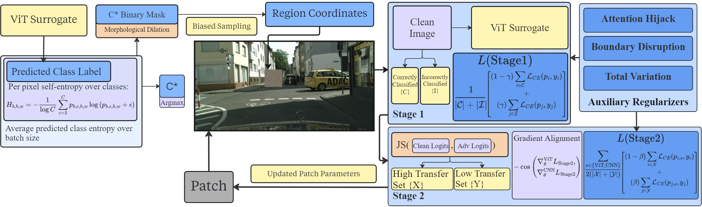

# OmniPatch: Universal Adversarial Patch for ViT-CNN Cross-Architecture Transfer in Semantic Segmentation


**Overview.** *OmniPatch* is a framework for learning a **single, physically-deployable adversarial patch** that **generalizes across images and both ViT and CNN segmentation models** without access to target model weights. It employs **sensitive-region placement** based on predictive entropy, a **two-stage training curriculum** (ViT-only → ViT+CNN ensemble) with **gradient alignment**, and **auxiliary objectives** (attention hijacking, boundary disruption, total variation) to maximize **black-box transferability** across architectures.

---

## Method


### Sensitive-Region Placement

Using a ViT surrogate, we compute class-wise predictive entropy on clean images and select the class with highest uncertainty. The patch is placed on high-uncertainty regions using entropy-biased sampling restricted to the top-p% of sensitive locations.


### Two-Stage Training

**Stage 1 (ViT-only):** Optimize the patch to destabilize the ViT surrogate by targeting high-confidence predictions using weighted cross-entropy.

**Stage 2 (ViT+CNN ensemble):** Extend training to a heterogeneous ensemble, mining high-transfer pixels (high Jensen-Shannon divergence) and weighting them relative to low-transfer regions.

### Gradient Alignment

Standard ensemble training causes destructive gradient interference. We maximize cosine similarity between ViT and CNN gradients to homogenize update directions and prevent conflicting gradient flows.

### Auxiliary Losses

- **Attention Hijacking:** Force ViT to prioritize the patch over true labels in internal representations.
- **Boundary Disruption:** Induce fragmentation in segmentation boundaries.
- **Total Variation:** Noise control regularizer ensuring smoothness.

### Physical Robustness

Apply Expectation-over-Transformation (EOT) with random scale, rotation, and translation during training.

---

## Repository Structure

```
.
├─ Experiments/                # Evaluation scripts
├─ configs/                    # YAML configurations
├─ dataset/                    # Data loaders
├─ metrics/                    # Evaluation metrics (mIoU, IOU)
├─ patch/                      # Patch priors and parameterization
├─ pretrained_models/          # Pretrained segmentation models
├─ trainer/
│  └─ trainer_TranSegPGD_AdvPatch.py  # Main OmniPatch trainer
├─ utils/                      # Utilities
└─ README.md
```

---

## Results

Experiments on Cityscapes dataset. Patch size: 200×200 (1.9% area). mIoU measured on validation set.

| Model        | Clean mIoU | Random Patch | OmniPatch | mIoU Drop (%) |
| ------------ | ---------: | -----------: | --------: | -----------: |
| PIDNet-S     |    0.8695  |     0.8651   |  0.7299   |      15.96   |
| PIDNet-M     |    0.8681  |     0.8618   |  0.7393   |      14.84   |
| PIDNet-L     |    0.9035  |     0.8996   |  0.7530   |      16.65   |
| BiSeNetV1    |    0.7149  |     0.7057   |  0.6410   |      10.33   |
| BiSeNetV2    |    0.6907  |     0.6845   |  0.6036   |      12.61   |
| SegFormer    |    0.7434  |     0.7431   |  0.6777   |       8.83   |

OmniPatch achieves significant mIoU drops (8.83%–16.65%) across diverse CNN and ViT architectures, demonstrating robust cross-architecture transferability. The patch targets the *pole* class (identified as most sensitive via entropy analysis) and is placed using the proposed entropy-biased spatial positioning.

---

## Setup & Usage

### Environment

```bash
conda create -n omnipatch python=3.10 -y
conda activate omnipatch
pip install torch torchvision --index-url https://download.pytorch.org/whl/cu118
pip install -r requirements.txt
```

### Data

Download Cityscapes and set `CITYSCAPES_DIR=/path/to/cityscapes`. Expected structure:

```
CITYSCAPES_DIR/
  ├─ leftImg8bit/{train,val,test}/...
  └─ gtFine/{train,val,test}/...
```

### Training & Evaluation

Training and evaluation notebooks are provided in the `kaggle/` folder:

- **`adversarial-patch-train.ipynb`** – Minimal patch baseline and sanity checks. Start here for a basic example.
- **`adv-patch-evaluation.ipynb`** – Full training pipeline and cross-architecture evaluation.

These notebooks contain the complete training loop using `trainer_TranSegPGD_AdvPatch.py` with all hyperparameters configured. Refer to them for reproducible runs and detailed parameter tuning.

---

